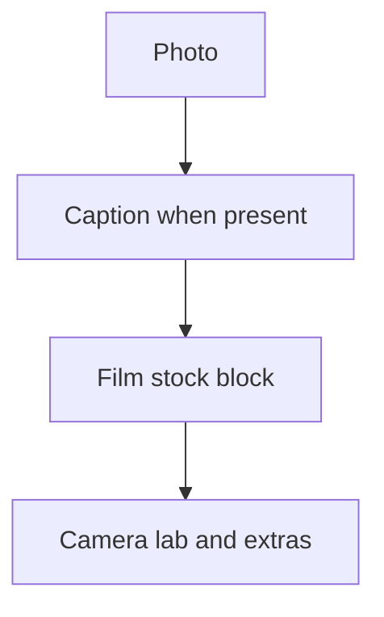

# Lightbox metadata design exploration

This document explores layout and hierarchy options for **film stock**, **camera**, and **lab / scanner** (and related fields) in the **image lightbox** bottom sheet. It is a design reference only; implementation lives in [`src/components/image-lightbox.tsx`](../src/components/image-lightbox.tsx).

**How to read this doc:** Each direction below is written as a **design spec**—intent, visual weight, typography, spacing, and behaviour—not as markup or wireframe ASCII. Use them to judge *feel* and *priority* before locking pixels in code.

**Visual mockups:** Open [`lightbox-metadata-mockups.html`](./lightbox-metadata-mockups.html) in a browser (static HTML; use “Toggle dark mode” to preview both themes). Each direction A–F is shown in a phone-width frame with sample content. **The live lightbox** uses a **flat list** after the caption: one metadata stack with **0.5px hairlines above the first and below the last row**, plus dividers between rows—**no extra standalone divider element**. Film / camera / lab / extras use **transparent film thumb** and **full-width strip hovers** (no rounded chips). Direction C in this doc still describes the disclosure variant; the app uses the “stacked sections” idea without any enclosing card.

### Attention flow (target hierarchy)

Gear should sit at the **lowest** contrast and weight in this chain unless the user explicitly opens more detail (where a direction allows that).

---

## Goals and constraints

- **Visual hierarchy**: Photo first, then caption (when present), then **film** as the main “context” affordance, then **gear** (camera, lab, etc.) as supporting detail.
- **Film is the hero**: Box image + stock name should read clearly and remain the **primary tap target** to the film images landing page (`/images/film/{slug}` when slug is known).
- **Gear stays quiet**: Camera and lab should not compete with the image or long captions for attention or vertical space.
- **Touch targets**: Tappable rows need comfortable hit areas (~44px where possible); secondary disclosure can trade minimum height for less visual weight.
- **Truncation**: Long camera names, lab names, and lens strings must truncate or wrap gracefully without breaking layout.
- **Dark mode**: Any card, hairline, or muted text treatment should work on both themes.
- **Progressive disclosure** (optional): Collapsed summaries can hide detail until the user expands—good for density, adds interaction cost.

---

## Reference: information map

Data is assembled from the active slide (`ImageLightboxData`) and optional roll metadata patches. Rough mapping:

| User-facing idea | Typical source | Notes |
|------------------|------------------|--------|
| Film name | `stockCard.name` or `context.label` | Primary line for stock. |
| Format + shot ISO | `metadata.format`, `metadata.shot_iso` (and roll patch) | Often shown as one secondary line, e.g. `35mm \| Shot at ISO 200`. |
| Film thumbnail | `stockCard.imageUrl` | Small box art; fallback icon if missing. |
| Camera | `metadata.camera` | Often linked to `/images/camera?name=…`. |
| Lens | `metadata.lens` | Shown under camera when camera exists; else may appear in aperture/ISO row. |
| Lab | `metadata.lab` | Public label via `filmLabPublicLabel`. |
| Scanner | `metadata.scanner` | Second line under lab when both exist. |
| Push / pull | `metadata.push_pull` | Single muted row when set. |
| Lens / ISO / format (fallback) | lens, shot ISO, format | Row when **no** camera, to avoid losing ISO/format. |

Example copy used in directions below: stock **“Kodak Portra 400”**, camera **“Leica M6”**, lab **“The Darkroom”**.

---

## Design direction A — Single quiet card

**Intent**  
Treat stock and gear as **one cohesive object**—a single inset surface so the eye rests once, then reads top-to-bottom. Film owns the top of the card; everything below reads as “supporting facts for this frame.”

**Visual weight**  
Film: strongest type in the block (title weight), with box art at current or slightly larger size. Gear: **one step lighter** than film title—same family but regular weight, with **micro-labels** (“Camera”, “Lens”, “Lab”) at low contrast so values carry the meaning.

**Layout and spacing**  
Horizontal film row (thumb + two lines of text) first. Optional **soft divider** (1px hairline at very low opacity) before gear—not a loud section break, just “we’re in details now.” Gear uses **consistent left alignment** with labels in a narrow column and values in the flexible column so scanning is vertical.

**Interaction**  
Whole film zone remains the obvious navigation to the film images surface. Camera value is tappable where you already deep-link; lab/scanner can stay static or gain links later without changing the overall shape.

**Tone**  
Calm, editorial, “back of slide mount” energy—informational, not dashboard-y.

**Tradeoffs**  
**Strengths:** One bounded surface; gear clearly subordinate; easy to parse for users who read everything. **Risks:** Tallest variant when every field is filled; card fill and border must stay subtle or the block feels like a second app screen.

---

## Design direction B — Film card + inline chips / footnote line

**Intent**  
**Separate planes:** film is a discrete “product chip”; camera and lab are **ambient context**—like a location line under a post, not a second card.

**Visual weight**  
Film card keeps border/background slightly stronger than body. Below it, **one muted sentence** (or two short lines): dot-separated fragments or **pill-shaped chips** with generous horizontal padding so chips feel tappable without shouting.

**Layout and spacing**  
Tight **vertical gap** between card bottom and footnote (small rhythm, same as caption-to-metadata). Single line preferred; second line only for overflow (e.g. lens) or when chips wrap on narrow widths.

**Interaction**  
Either one line is purely informational, or each chip is its own hit target (camera vs lab). If chips, enforce minimum touch width so it does not become a “text string you can’t hit.”

**Tone**  
Social, lightweight, “glance and move on”—gear never competes with the photo.

**Tradeoffs**  
**Strengths:** Minimal height; film vs gear separation is obvious. **Risks:** Aggressive truncation hides nuance; multiple taps on one row need clear affordance.

---

## Design direction C — Film hero + collapsible “Gear”

**Shipped variant (app):** **No card or box** around metadata: a vertical stack with **`border-t` / `border-b`** (0.5px) framing the block—**above the first and below the last** metadata row—and `divide-y` between rows. The stack uses **`-mx-4 w-[calc(100%+2rem)]`** so those outer lines match the **full width** of the inter-row hairlines. **No top padding** under the upper line (first row sits flush below it). The lightbox **profile row** wraps the avatar in the same **`h-10 w-10`** flex slot as metadata icons, with a **32×32** circular avatar inside (`h-8 w-8`) and **`gap-2`**, so the **username** still starts at the same **64px** inset as roll title / caption and metadata primary lines. Rows use **`px-4 py-2`**, **`gap-2`**, and **`items-center`** so copy stays vertically centered next to the film thumb and matching icon column. Lucide metadata icons use **`size-5`** inside the 40px slot.

**Intent (original spec)**  
Default lightbox = **photo + people + caption + film**. Gear exists as a **single compressed hint**; detail is opt-in so attention returns to the image.

**Visual weight**  
Film block unchanged as the hero. Below: one **summary line** at caption-secondary weight—camera and lab names only, joined by a middle dot—with a **small chevron** or “Gear” affordance that reads as control, not as part of the film link.

**Layout and spacing**  
Collapsed: one row, ~same height as a compact list row. Expanded: **stacked rows** with comfortable tap height for camera link and lab lines; optional gentle **height transition** (respect reduced motion).

**Interaction**  
Explicit **disclosure control** (not nested inside the film link) so film tap stays predictable. Expanded panel feels like “the same sheet, more text” rather than a new modal.

**Tone**  
Confident minimalism—assumes most viewers care about stock, not lab hardware.

**Tradeoffs**  
**Strengths:** Quietest default; best when vertical space and distraction are the pain. **Risks:** One more tap; summary string rules for missing fields; disclosure must be accessible (expanded state, focus, keyboard).

---

## Design direction D — Larger film thumbnail + label/value pairs

**Intent**  
Make film feel **tangible** (bigger box art) and push gear into a **spec block**—still inside one card if you want containment, but visually “below the fold” inside that card.

**Visual weight**  
Thumbnail steps up (e.g. toward **~48–56px** edge) so stock reads almost like merchandise. Gear block uses **all-caps or wide-tracking micro labels** at very low opacity next to sentence-case values—spec sheet hierarchy, not list rows.

**Layout and spacing**  
Top: horizontal pair (image rail + text stack). Bottom: **two-column grid**—narrow label column, value column—with generous line height for lens and scanner sublines.

**Interaction**  
Camera value remains the primary secondary link; labels are not interactive.

**Tone**  
Product detail page shrunk into a card—trustworthy, slightly technical.

**Tradeoffs**  
**Strengths:** Film feels premium; gear is clearly secondary through typography alone. **Risks:** Label column can feel busy on narrow phones; overall block height similar to A.

---

## Design direction E — Icon strip (combined gear row)

**Intent**  
One **horizontal band** of gear after the film card: **icon + text** pairs for camera and lab, same baseline, **no second product thumbnail** for lab—avoids “two cards fighting.”

**Visual weight**  
Icons at **tertiary** stroke weight and size (visually smaller than action icons above). Text at footnote size, truncated with ellipsis; optional trailing affordance (“more”) if you add overflow.

**Layout and spacing**  
Single row when possible; icons left-aligned in their own fixed-width slots so text baselines align. If camera and lab need separate destinations, use **two clear tap zones** with invisible split or visible gap—not one ambiguous hotspot.

**Interaction**  
Decide explicitly: **split targets** (preferred for clarity) vs one row that opens a small bottom sheet for “gear detail.”

**Tone**  
Dense, utility strip—feels native to mobile toolbars and metadata rows.

**Tradeoffs**  
**Strengths:** Very compact; strong icon vocabulary. **Risks:** Hit targets and truncation; icon parity (camera vs lab) must match in weight.

---

## Design direction F — Footer caption style (no hairlines)

**Intent**  
Only the **film** uses elevated chrome (rounded card, border, or fill). Camera and lab read as **continuation of caption typography**—same emotional register as tags or date line.

**Visual weight**  
Footnotes: **11–12px**, muted foreground, **no dividers**, no full-bleed bands. Optional subtle **letter-spacing** on a joined lab line for readability, not decoration.

**Layout and spacing**  
Small margin between film card bottom and first gear line. Stack: camera name, lens on next line if present, then lab with scanner joined by a middle dot—**ragged left**, like prose.

**Interaction**  
Camera can be a text link with underline-on-hover only, or no underline until hover—keep it gentle. Lab link policy same as today unless you add routes.

**Tone**  
Literary / gallery label—whispers instead of lists.

**Tradeoffs**  
**Strengths:** Lightest chrome; no competing lines against sheet edges. **Risks:** Weaker scan pattern for “where is lab”; long strings need good line-breaking rules.

---

## Recommendation sketch (non-binding)

For **maximum de-emphasis of gear** while keeping film obvious and tappable, **direction C** (collapsed summary + expand) or **direction B** (single muted footnote line) usually fits best: both keep the photo and caption as the story, and relegate camera/lab to “small type” unless the user asks for more.

If you want **zero extra taps** and can tolerate slightly more vertical text, **direction F** or **direction A** (single card with quiet labels) keeps everything visible without the strong “list of rows” feel of full-bleed hairlines.

---

## Implementation notes (for when you pick a direction)

- **Scope**: Most options are changes inside [`src/components/image-lightbox.tsx`](../src/components/image-lightbox.tsx) (markup + `className`s). **C** may warrant a tiny subcomponent (e.g. `LightboxGearDisclosure`) for state and a11y.
- **URLs**: Keep existing behaviour: film → `/images/film/{slug}` or fallback `stockCard.href` / `context.href`; camera → `/images/camera?name=…` where linked today.
- **Accessibility**: If using disclosure (**C**), use a `<button>` for the control, `aria-expanded`, and associate expanded content with `aria-controls` / stable `id`s; ensure focus order is logical when expanding inside the sheet.
- **Lab row**: Today lab/scanner is not always a link; decide per design whether lab becomes tappable to a future `/images/lab` route or stays plain text.
- **Motion**: Optional short height animation on expand (respect `prefers-reduced-motion`).

---

## Changelog

| Date | Author | Note |
|------|--------|------|
| 2026-04-11 | — | Initial exploration doc from product plan. |
| 2026-04-11 | — | Rewrote directions A–F as design specs (hierarchy, typography, interaction, tone); added attention-flow diagram; removed ASCII wireframes. |
| 2026-04-11 | — | Linked static HTML visual mockups (`lightbox-metadata-mockups.html`). |
| 2026-04-11 | — | Lightbox metadata implements direction E (icon strip); mockups page notes canonical direction. |
| 2026-04-11 | — | Lightbox metadata switched to direction C variant: one card, multiple visible sections (no accordion). |
